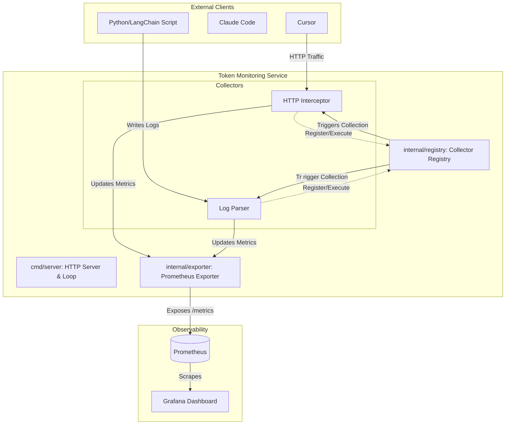

# Token Monitoring Service

A Go-native application designed to intercept, monitor, and export LLM (Large Language Model) token usage metrics from various clients (like Cursor, Claude Code, etc.) to Prometheus and Grafana.

## 🚀 Overview

The `token-monitoring` service provides a centralized way to track token consumption across different development tools. It uses an extensible "Collector" architecture, allowing you to easily add new sources of usage data without modifying the core engine.

## 🏗️ Architecture



The application follows a modular **Registry-Collector** pattern:

### 1. Central Registry (`internal/registry`)
The heart of the system. The `Registry` maintains a thread-safe list of all active `Collectors`. It is responsible for triggering the collection cycle (e.g., every 15 seconds) and ensuring that no duplicate collectors are registered.

### 2. Extensible Collectors (`internal/collectors`)
Each collector implements a simple `Collector` interface:
```go
type Collector interface {
    Name() string
    Collect() error
}
```
Collectors act as "scrapers" for specific data sources. When `Collect()` is called, the collector looks for usage patterns and reports them back to the system.

**The beauty of the Collector Pattern is that the Registry doesn't care how a collector finds data; it only cares that the collector implements the <code class="language-go">Collect() error</code> method. You can integrate any engine as long as you can implement a new Collector for it:**

| Engine | Extraction Strategy (The "How") | Required Collector Type |
| :--- | :--- | :--- |
| **OpenAI / Anthropic API** | Intercept HTTPS traffic via a proxy or middleware. | `HTTPInterceptor` |
| **Local Python/LangChain Script** | Use a FileWatcher to monitor a JSON log file where the script writes its usage. | `LogParser` |
| **vLLM / TGI (Production)** | Query the engine's own Prometheus endpoint and aggregate it into our Registry. | `PrometheusScraper` |
| **Llama.cpp (Local Binary)** | Parse the standard output (`stdout`) of the binary for "tokens/s" strings. | `ProcessParser` |

**Current Implementations:**
*   **HTTP Interceptor**: Simulates capturing token usage by intercepting or observing HTTP request/response bodies (e.g., looking for `usage` fields in OpenAI-compatible API responses).
*   **Log Parser**: Scans local log files for specific patterns, regexes, or structured JSON entries that indicate how many tokens were processed in a recent request.

### 3. Metrics Exporter (`internal/exporter`)
The exporter leverages the **Prometheus Client Library**. As collectors find data, they update global Prometheus counters and gauges. The service exposes these metrics via an HTTP endpoint, making them immediately scrapeable by Prometheus.

### 4. Data Flow
1.  **Trigger**: The `cmd/server` main loop triggers `Registry.ExecuteAll()` at a defined interval.
2.  **Extraction**: Each `Collector` independently probes its target (HTTP traffic, log files, etc.).
3.  **Aggregation**: Collectors call `exporter.UpdateTokenUsage(...)` with the discovered counts.
4.  **Dissemination**: The Prometheus registry updates its internal state.
5.  **Consumption**: An external Prometheus instance scrapes `http://localhost:8081/metrics`.

## 📊 Metrics Exposed

| Metric Name | Type | Description | Labels |
| :--- | :--- | :--- | :--- |
| `llm_tokens_used_total` | `Counter` | Total number of tokens consumed. | `collector`, `type` (e.g., prompt, completion) |
| `llm_tokens_last_collected_timestamp` | `Gauge` | Timestamp of the last successful collection. | `collector` |

## 🛠️ Getting Started

### Prerequisites
*   Go 1.26+
*   Docker (optional, for containerized execution)

### Running Locally
1. Clone the repository.
2. Start the server:
   ```bash
   go run cmd/server/main.go
   ```
3. Verify metrics are flowing:
  ```bash
  curl http://localhost:8081/metrics | grep llm_tokens_used_total
  ```

### Running with Docker
```bash
docker build -t token-monitoring .
docker run -p 8081:8081 token-monitoring
```

## 🛠️ Development

### Adding a New Collector
To add a new source (e.g., monitoring a database or an OS-level socket):
1. Create a new file in `internal/collectors/`.
2. Implement the `Collector` interface.
3. Register your new collector in `cmd/server/main.go`.

### Testing
Run all unit tests using:
```bash
go test ./...
```

## 📝 License
This project is licensed under the MIT License.
