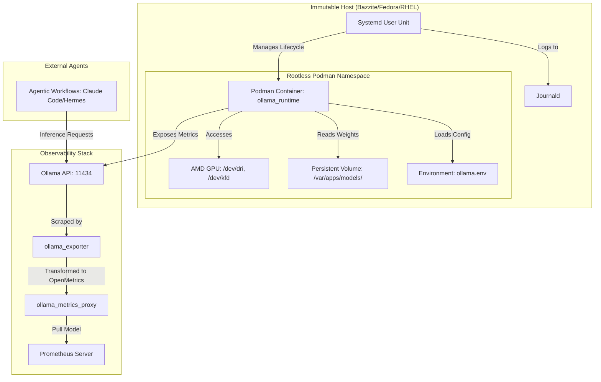

# Engineering Specification: Ollama Self-Hosting Architecture (Pattern Beta)

**Version:** 2.0 (Production Standard)  
**Status:** Finalized for Infrastructure Deployment  
**Architecture Pattern:** OCI-Complimant Rootless Orchestration (Pattern Beta)  
**Target Substrate:** Immutable Linux (Bazzite, Fedora Silverblue, RHEL CoreOS)

---

## 1. Executive Summary: The Deterministic Imperative

In modern agentic pipelines, the reliability of the inference engine is a prerequisite for autonomous decision-making. This specification defines the architecture for deploying [Ollama](https://ollama.com/) as a highly isolated, hardware-accelerated, and observable workload. 

As we integrate Large Language Model (LLM) runtimes into automated agentic workflows, the primary engineering challenge has shifted from simple "inference latency" to **deployment predictability**. This architecture adopts **Pattern Beta (OCI-Compliant Containerized Orchestration)**, rejecting the risks of Pattern Alpha (Native Systemd - prone to configuration drift) and Pattern Gamma (Source Build - high TCO/maintenance burden). By leveraging **Rootless Podman** and **Systemd User Units**, we achieve a deployment that adheres to the principle of **Infrastructure Immutability**, ensuring that the host OS remains untouched by the lifecycle of the LLM runtime.

---

## 2. Orchestration Layer: Rootless OCI Workloads

The orchestration layer utilizes [Podman](https://podman.io/) to run Ollama within a non-privileged user namespace. This mitigates the risk of container escapes compromising the host kernel by leveraging **User Namespaces (userns)**.

### 2.1 User Namespace & Rootless Security Implementation

Unlike Docker, which traditionally requires a root-level daemon, Podman operates in a "daemonless" mode. In this architecture:
*   **UID/GID Mapping**: The container's `root` user is mapped to a non-privileged UID on the host via `/etc/subuid` and `/etc/subgid`. This ensures that even if an attacker achieves a breakout from the Ollama process, they only possess the privileges of the unprivileged host user.
*   **Namespace Isolation**: The container maintains its own network, mount, and PID namespaces. The `--device` flags for `/dev/dri` and `/dev/kfd` are explicitly permitted through the cgroup controller, allowing hardware access without granting full device-node visibility to the container.

### 2.2 Deployment Command & Parameter Analysis

The production deployment is executed via a highly parameterized `podman run` command:
// ...existing code...

```bash
podman run -d \
  --restart=always \
  --name ollama_runtime \
  -p 11434:11434 \
  --device /dev/dri \
  --device /dev/kfd \
  --ulimit nofile=1048576:1048576 \
  --env-phi=/var/apps/ollama.env \
  -v /var/apps/payloads/:/var/apps/models/:z \
  docker.io/ollama/ollama:latest
```

#### Low-Level Engineering Breakdown:

*   **Hardware Access (`--device /dev/dri` & `/dev/kfd`)**: 
    *   **Context**: For AMD-based systems, access to the **Direct Rendering Infrastructure (DRI)** and the **Kernel Fusion Driver (KFD)** is non-negotiable.
    *   **Technicality**: This allows the containerized ROCm/HIP runtime to interface with the host's GPU kernel drivers, enabling hardware-accelerated compute for LLM kernels.
*   **Resource Constraints (`--ulimit nofile`)**: 
    *   **Context**: High-concurrency agentic workloads (e.g., Claude Code) can trigger file descriptor exhaustion during massive context processing.
    *   **Technicality**: Setting `nofile` to $1,048,576$ ensures the runtime can manage the high number of concurrent socket connections and model weight reads required by parallelized inference streams.
*   **SELinux & Data Integrity (`:z` flag)**:
    *   **Context**: On SELinux-enforced systems like Bazzite, container access to host volumes is blocked by default.
    *   **Technicality**: The `:z` suffix triggers a `relabel` operation, transitioning the context of the mounted directory from `unlabeled_t` or `user_home_t` to `container_file_t`. This allows the rootless process to read model weights without violating Mandatory Access Control (MAC) policies ([Ref: Red Hat SELinux Guide](httpsinit)).
*   **Environment Decoupling (`--env-file`)**: 
    *   Separates the **Immutable Image** from the **Hardware-Specific Configuration**, allowing a single, audited OCI image to be promoted across diverse GPU generations (e.g., GFX1030 vs GFX1151) via simple configuration injection.

---

## 3. Hardware Abstraction Layer (HAL) Tuning

The performance of the inference engine is strictly governed by the external's environment variables defined in `/var/apps/ollama.env`. These settings optimize the **Llama.cpp** backend for specific hardware instruction sets (ISAs). At a low level, these parameters influence the compilation-time optimizations and runtime kernel dispatching within the ROCm/HIP stack.

#### Expanded Configuration Matrix
// ...existing code...

| Parameter | Production Value | Engineering Rationale & Upstream Context |
| :--- | :--- | :--- |
| `HSA_OVERRIDE_GFX_VERSION` | `11.5.1` | **ISA Compatibility**: Forces the ROCm runtime to treat the GPU as a compatible target, bypassing version-mismatches in driver-to-library handshakes ([Ref: AMD ROCm Docs](https://rocm.docs.amd.com/)). |
| `OLLAMA_IGPU_ENABLE` | `1` | **iGPU Optimization**: Enables efficient compute utilization for AMD integrated graphics architectures. |
| `OLLAMA_NUM_CTX` | `65536` | **Context Expansion**: Sets the KV (Key-Value) cache window to 64k tokens, critical for long-context agentic reasoning. |
| `OLLAMA_CONTEXT_LENGTH` | `65536` | **Deterministic Windowing**: Ensures consistent context handling across different model quantizations. |
| `OLLAMA_KV_CACHE_TYPE` | `q4_0` | **Memory Bandwidth Optimization**: Uses 4-bit quantization for the KV cache to reduce memory pressure during massive context processing. |
| `OLLAMA_FLASH_ATTENTION` | `true` | **Attention Efficiency**: Enables FlashAttention kernels to reduce quadratic complexity in memory access during attention mechanism computations. |
| `OLLAMA_KEEP_ALIVE` | `24h` | **Lifecycle Management**: Prevents frequent model reloading by maintaining the runtime in VRAM for extended periods. |
| `OLLAMA_LOAD_TIMEOUT` | `20m0s` | **Robustness**: Provides sufficient buffer for large model weight loading from persistent storage without triggering timeout errors. |
| `LLAMA_ARG_N_GPU_LAYERS` | `999` | **VRAM Residency**: Forces all model layers into VRAM, bypassing the latency penalty of host-to-device (PCIe) transfers during layer swapping. |
| `LLAMA_ARG_BATCH` | `512` | **Throughput Optimization**: Sets the batch size for prompt processing to optimize GPU compute utilization. |
| `LLAMA_ARG_UBATCH` | `512` | **Micro-batching Efficiency**: Aligns micro-batch sizes with hardware-specific cache line architectures. |
| `GGML_VK_REALLOC` | `1` | **Driver Stability**: Manages Vulkan resource reallocation to prevent driver-level memory fragmentation during high-concurrency workloads. |
| `OLLAMA_MODELS` | `/var/apps/models/` | **Persistence Strategy**: Redirects weights to a persistent, non-volatile volume outside the container lifecycle. |

---

## 4. Observability & Telemetry Pipeline

The architecture implements a three-tier observability stack based on the [Prometheus Pull Model](https://prometheus.io/docs/prometheus/latest/introduction/overview/).

### 4.1 Data Flow Architecture
`Ollama API (Port 11434)` $\rightarrow$ `ollama_exporter` $\rightarrow$ `ollama_metrics_proxy` $\rightarrow$ `Prometheus Scraper`

1.  **Source (Inference Engine)**: The Ollama runtime exposes internal metrics via HTTP endpoints, primarily as JSON-formatted snapshots of the current engine state.
2.  **Transformation (`ollama_exporter`)**: A specialized microservice that scrapes the raw application state and transforms it into the **OpenMetrics/Promint Prometheus text format**. 
    *   **Low-Level Implementation**: The exporter performs HTTP GET requests to the Ollama API, parses the JSON payload, and maps specific keys to Prometheus metric types:
        *   **Counters**: For monotonically increasing values like `ollama_model_load_total`.
        *   **Gauges**: For instantaneous values like `ollama_vram_usage_bytes` or `ollama_active_requests`.
    *   **Complexity Reduction**: This transformation step is critical for normalizing heterogeneous application metrics into a standardized format that Prometheus can ingest without custom parsing logic per model.
3.  **Gateway (`ollama_metrics_proxy`)**: Provides a stable, static endpoint (`9400-9401/tcp`). 
    *   **Engineering Advantage**: By using a proxy, the primary inference service can be rotated (via image updates) without breaking the configuration of global monitoring agents or triggering alert fatigue in Prometheus. It also allows for request filtering and rate limiting at the edge of the observability boundary.

---

## 5. Lifecycle Management: Systemd User Integration

To integrate the ephemeral container into the host's permanent state, we leverage **Systemd User Units**. This approach maintains "Infrastructure as Code" by managing the service via the user-level init daemon.

### 5.1 Deployment Workflow

The transition from an active Podman container to a managed system service is executed through the following lifecycle:

```bash
# 1. Generate the unit file from the running container state
podman generate systemd --files --name ollama_runtime

# 2. Deploy to the user-level configuration directory
mkdir -p ~/.config/systemd/user/
mv container-ollama_runtime.service ~/.config/systemd/user/

# 3. Enable and Activate within the session context
systemctl --user enable --now container-ollama_runtime.service
```

**Implication**: This ensures that the `ollama` workload is automatically restarted on host boot, follows system-wide logging (via `journald`), and remains entirely decoupled from the global `/etc/systemd` configuration.

---

### 6. Verification Protocol

Regardless of the deployment pattern, all production-grade Ollama workloads must pass the following three-tier audit to ensure operational integrity and security compliance.

#### 1. Identity Check
Verify that the runtime is correctly loading the intended model weights from the persistent volume.
```bash
ollama list | grep -E "gemma4|llama3"
```
*   **Success Criteria**: The expected model version (e.g., `gemma4:26b`) is present and matches the deployment manifest.

#### 2. Resource Audit
Inspect the system logs to ensure the hardware-accelerated backend (ROCm/Vulkan) initialized without errors.
```bash
journalctl -u container-ollama_runtime.service --no-pager --since "5 min ago" | grep -iE "error|fail|vulkan|rocm"
```
*   **Success Criteria**: No error or failure messages related to GPU driver handshakes or kernel module access are present in the logs.

#### arg: Isolation Check
Confirm that the container is running within a non-privileged user namespace and has correctly applied SELinux relabeling for host volumes.
```bash
podman inspect ollama_runtime --format '{{ .Mounts }}' | grep ":z"
podman inspect ollama_runtime --format '{{ .Config.Labels }}'
```
*   **Success Criteria**: The `:z` flag is reflected in the mount configuration, and the container process is not running as `root`.

---

## 2. System Architecture & Component Interaction

The architecture is designed around the principle of **Layered Decoupling**. Each layer (Orchestration, Hardware Abstraction, and Observability) operates within its own boundary, ensuring that changes to one do not necessitate a reconfiguration of the others.

### 2.1 Architectural Topology

The following diagram illustrates the interaction between the immutable host substrate, the rootless containerized runtime, and the external observability stack.



### 2.2 Component Interaction Breakdown

1.  **The Control Plane (Systemd User)**: Acts as the supervisor, ensuring the container is restarted on failure and initialized during user session startup.
2.  **The Execution Plane (Podman/Ollama)**: The isolated runtime that performs the heavy lifting of LLM inference, utilizing hardware acceleration via passed-through device nodes.
    *   **Isolation Mechanism**: Uses `subuid`/`subgid` mapping to provide a private user namespace, preventing the container from seeing or interacting with host processes.
3.  **The Data Plane (GPU/VRAM)**: The physical substrate where the actual computation occurs, driven by ROCm/HIP kernels.
4.  **The Observability Plane (Prometheus/Exporter)**: A unidirectional telemetry stream that monitors the health and performance of the execution plane without interfering with the inference latency.
